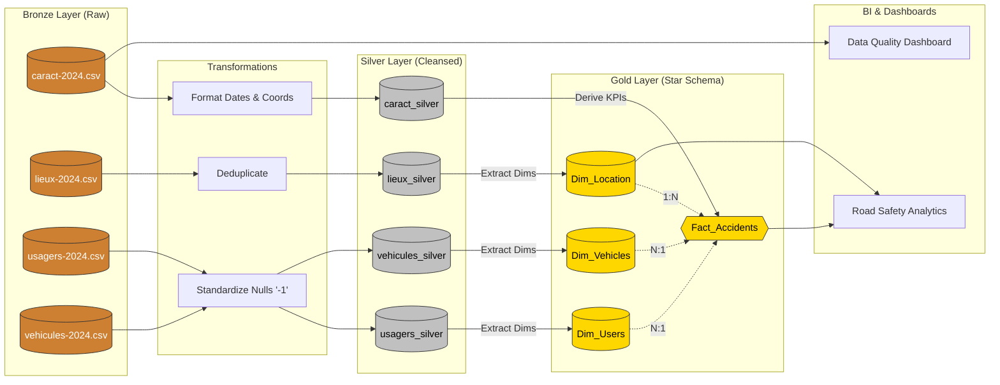

# Part B: Modeling (Gold Layer)

To support efficient road-safety analytics and Business Intelligence (BI) tools, the cleansed Silver layer must be transformed into a **Star Schema** (Fact and Dimension tables) for the Gold layer.

### 1. Fact Table: `Fact_Accidents`
This is the central table containing the measurable, quantitative metrics of each road accident.
* **Grain:** One row per unique accident (`Num_Acc`).
* **Foreign Keys:** `Location_Key`, `Date_Key`.
* **Measures:** `total_fatalities`, `total_hospitalized`, `severity_index` (derived from the Silver layer).
* **Degenerate Dimensions:** `lat`, `long`, `time_of_day`, `lum` (lighting conditions), `agg` (location type).

### 2. Dimension Tables
These tables provide the descriptive context surrounding each accident.
* **`Dim_Location` (Sourced from `lieux_silver`):**
  * Attributes: `catr` (Road category), `circ` (Traffic regime), `vosp` (Reserved lane type), `prof` (Road profile).
* **`Dim_Vehicles` (Sourced from `vehicules_silver`):**
  * Attributes: `id_vehicule`, `catv` (Vehicle category), `obs` (Fixed obstacle hit), `choc` (Initial point of impact).
* **`Dim_Users` (Sourced from `usagers_silver`):**
  * Attributes: `id_usager`, `catu` (User category: driver/pedestrian), `sexe`, `an_nais` (Birth year), `trajet` (Reason for travel), `secu1`/`secu2` (Safety equipment).

---

# Part C: Medallion Architecture Diagram

Below is the complete Medallion Architecture flow showing the progression of data from raw ingestion to the final analytical layer.

---

# Deliverable 5: Justification of Design Choices

1. **Why Medallion Architecture?** The strict separation prevents corrupt raw data from affecting BI tools. The Silver layer acts as an idempotent, clean foundation, while the Gold layer is purely optimized for fast aggregation (read-heavy operations).
2. **Why a Star Schema in Gold?** The relational raw data (4 tables) requires complex joins. By centralizing the quantitative data into `Fact_Accidents` and pushing descriptive strings to Dimensions, we minimize query latency and avoid massive data duplication for downstream BI platforms like PowerBI or Tableau.
3. **Handling of `-1` (Null Imputation in Silver):** We chose to convert `-1` to `NULL` globally at the Silver layer rather than Gold. This ensures that any data scientist querying the Silver layer directly will not accidentally train a machine learning model where `-1` skews averages or clustering algorithms.
4. **Why a 1:N relationship between Dim_Location and Fact_Accidents?** An N:N relationship implies that a single car crash can occur in multiple completely disparate locations simultaneously, which is physically impossible. Therefore, a specific location can host *many* accidents over time (1 Location → N Accidents), but each accident record in the fact table links to exactly *one* location in the dimension table (1:N), maintaining strict physical and temporal integrity.
