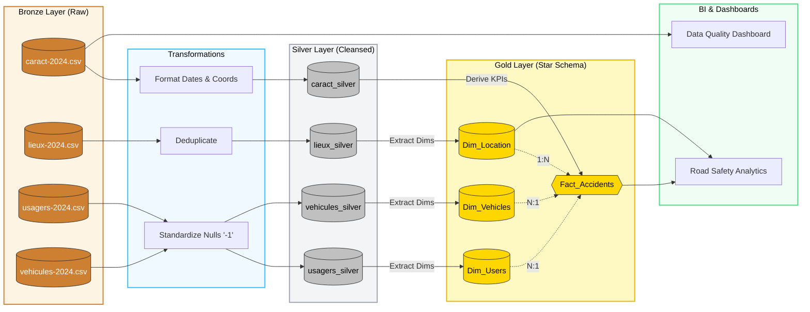

# French Road Safety Data Quality Analysis

This repository contains a comprehensive data quality assessment, ETL pipeline, and modeling suite for the 2024 French Road Safety (BAAC) dataset.

## ✅ Project Deliverables (Completed)

All required End-of-Day Deliverables for this project have been fully completed and are mapped to the files below:

1. **Data Profiling Report**
   - `data_profiling.ipynb`: Detailed Jupyter notebook with schema extraction, NaN quantification, and consistency checks.
   - `dashboard.py`: Premium Streamlit dashboard summarizing the profiling and data quality impact.
2. **Transformation Plan (Silver Layer)**
   - `Part_2_Transformation_Plan.md`: Written documentation of the standardization, cleaning, deduplication, and enrichment rules.
   - `etl_silver_layer.py`: The executable Python script that applies these transformations and outputs to the `/silver` directory.
3. **Analytical Model (Gold Layer)**
   - `Part_2_Architecture_And_Modeling.md` (Part B): Documentation of the Star Schema design (`Fact_Accidents` + Dimensions).
   - `etl_gold_layer.py`: The executable Python script that builds the Star Schema and outputs `.parquet` files to the `/gold` directory.
4. **Medallion Architecture Diagram**
   - `Part_2_Architecture_And_Modeling.md` (Part C): A complete Mermaid flowchart visually mapping the Bronze ➡️ Silver ➡️ Gold pipeline.
5. **Short Justification of Design Choices**
   - `Part_2_Architecture_And_Modeling.md` (Deliverable 5): Paragraphs explaining the choice of the Medallion architecture, Star Schema, and specific null-handling strategies.

---

## 🏛️ Medallion Architecture

Below is the complete data flow mapping the transformation of raw `.csv` files through the ETL pipeline into our final analytical Star Schema.



---

## Project Structure
- **`Part_2_*.md`**: Markdown documents containing the architectural models, transformation plans, and diagrams.
- **`etl_*.py`**: Python ETL scripts for building the Silver and Gold data layers.
- **`silver/` & `gold/`**: Directories containing the processed datasets.
- **`data_profiling.ipynb`**: Core Jupyter Notebook.
- **`dashboard.py`**: Streamlit executive dashboard.

---

## Running the Executive Data Quality Dashboard

The interactive Streamlit dashboard dynamically reads the datasets, computes missingness clusters, identifies pseudo-nulls (e.g., `-1`), and presents an interactive completeness matrix visualization.

### Prerequisites
Make sure you have Python installed along with `pandas` and `streamlit`.
```bash
pip install pandas streamlit
```

### Quickstart
1. Open your terminal (Command Prompt, PowerShell, or bash).
2. Navigate to this project directory:
   ```bash
   cd french-road-safety-data-quality
   ```
3. Run the Streamlit application:
   ```bash
   streamlit run dashboard.py
   ```
4. A new browser tab will automatically open at `http://localhost:8501`.
